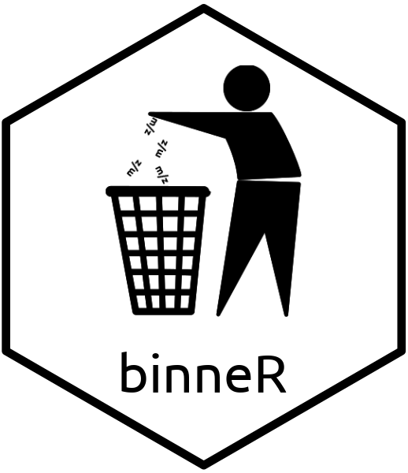

# binneR 

<!-- badges: start -->
[](https://www.tidyverse.org/lifecycle/#maturing)
[](https://github.com/aberHRML/binneR/actions)
[](https://codecov.io/github/aberHRML/binneR?branch=master)
[](https://cran.r-project.org/web/packages/binneR/index.html)

[](https://zenodo.org/badge/latestdoi/33118371)
<!-- badges: end -->

> **Spectral Processing for High Resolution Flow Infusion Mass Spectrometry**

A spectral binning approach for flow infusion  electrospray high resolution mass spectrometry (FIE-HRMS) data.
Includes tools for generating intensity matrices converted raw data file formats such as `.mzML` and `.mzXML`, plotting chromatograms and total ion counts.

#### Installation

Download and install from [CRAN](https://cran.r-project.org/web/packages/binneR/index.html), run the following in an R console:

``` r
install.packages('binneR')
```

The CRAN version can be found on the [cran](https://github.com/aberHRML/binneR/tree/cran) branch of this repository.

The example data used in this package are from the [metaboData](https://github.com/aberHRML/metaboData) package that can be installed using:

``` r
remotes::install_github('aberHRML/metaboData',build_vignettes = TRUE)
```

To download and install this development vesion run:

``` r
remotes::install_github('aberHRML/binneR',build_vignettes = TRUE)
```

#### Vignette

The vignette outlining the package usage and features can be found using:

``` r
vignette('binneR',package = 'binneR')
```
